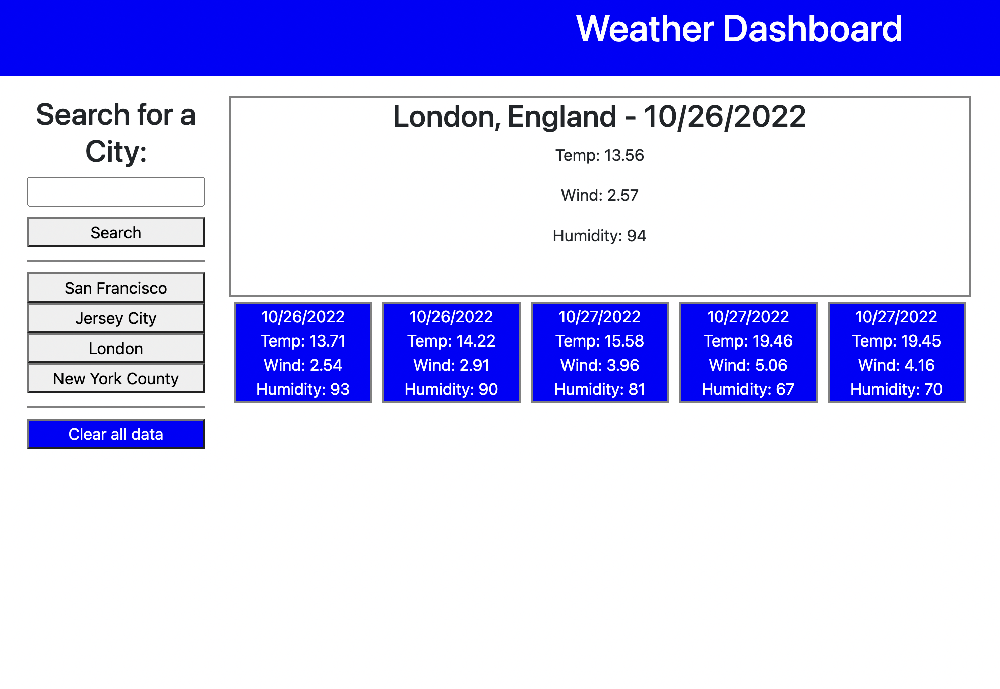

# Weather Dashboard
### A javascript-based weather monitoring project

This repository is for a weather dashboard app made for my UC Berkeley coding bootcamp. It allows the user to search for any city by name and view the current weather conditions as well as a five-day forecast. Search history is saved in local browser storage and can be cleared at any time.

The website is live on github pages [and can be viewed here.](https://studiomav.github.io/weather-dashboard/)

If all is well, the page should display like in this screenshot:

There is no license for this project and it is intended for educational purposes only.